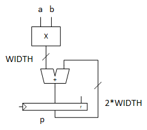

# sky130_cds
<pre>
James E. Stine, Jr.
james.stine@okstate.edu 
Oklahoma State University
School of Electrical and Computer Engineering
VLSI Computer Architecture Research Group

Rachana Erra
rachana.erra@okstate.edu
Oklahoma State University
School of Electrical and Computer Engineering
VLSI Computer Architecture Research Group
</pre>

Repository for SKY130 Process Design Kit and Cadence Design System tools. 

**Sample Designs:** 
Right now there are two sample designs in the repository. One is a purely combinational design (mult.sv) and the other is a combination of combinational and sequential (mult_seq.sv). Right now, the mult_seq design is set up but can be easily modified and changed, if needed.

**Instructions to run synthesis and pnr:**

1. git clone git@github.com:stineje/sky130_cds.git

2. **Set up PDK:** 
   a. cd sky130_cds 
   b. git submodule update --init --recursive 

3. **Run synthesis:** 
   a.cd synth 
   b.Add HDL to hdl subdirectory 
   c.Edit genus script.tcl to load in correct SV files  
   d.Also modify genus_script.tcl to add the timing needed any loading or input/output delays. There are also options for loading that can be changed. Right now, a FF is assumed to be at the beginning and end of the timing to constrain the timing properly.Constraint settings are found within the constraints top.sdc file. 
   e.make synth  
   f.All output is logged to synth.out that should be checked on completion. Reports are found within the reports directory and any mapped HDL is found in the top directory. 

4. **Place-and-Route:**    
   a. Edit setup.tcl and change the design, netlist, and sdc location. These can be found by searching for mult seq in a text editor. These items should match the files done through synthesis. 
   b.innovus_config.tcl has plugins that allow commands to be run when needed. Right now, some plugins are enabled and some are not. This file would have be edited if one would want to do an additional command. These commands can be done before or after a step -- e.g.,pre init or post init. 
   c.To start the process, a Makefile is used. Type the following in this order: init, place, cts, postcts hold, route, postroute, signoff. For example, you could type, make init to run through a design for the init phase. If one would want to just run through route, just type make route and the scripts should run through all the scripts until the end of route provided the other steps have not been initiated.This, of course, is provided there are no errors. 
   d.Any commands run through the pnr are in the LOG subdirectory. There is one file that lists the commands (i.e., cmd) and the other that lists output from the command or the log files (i.e., .log). Reports are found in the RPT subdirectory. 
   e.To pull up a placed-and-routed design from the route stage , start innovus and type: restoreDesign DBS/route.enc.dat/ mult_seq. It is important that the last argument be the top-level design indicated during the synthesis stage. 
 
 **Generating a qrcTechfile for PEX using Quantus:** 
qrcTechfile is a technology file specific to a PDK that is generated from an ict file. An ict file contains information about conductors, dielectrics, diffusion, substrate, via and so forth. It is created using the specified syntax for each of the commands. 
Techgen -si sky130.ict--> this command simulates  the ict files using Techgen to generate a qrcTechfile.

 
